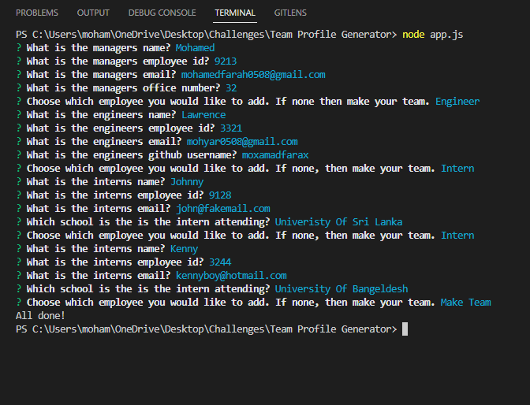

# team-profile-generator 

# Description

This project utilizes technologies and dependencies like node, jest, and inquirer to genereate an html page with cards
containing information about ones team of employees as well as their own information.

https://github.com/moxamadfarax/team-profile-generator

- This is a screenshot of the comamand line prompts given.

  

- This is a screenshot of what is generated.

  

## Table of Contents

- [Installation](#installation)
- [Usage](#usage)
- [Credits](#credits)
- [License](#license)

# Installation

The required software that needs to be installed to use this project node, jest and inquirer, and preferably software that allows you to view the html file generated in real time, like a code editor. To install node js navigate to their website from the browser and install the version you like. To install inquirer, open the command line and type "npm i inquirer@8.2.4". Give it some time to fully install. To install jest, open the command line and type "npm i jest". Also give this some time to install.

# Usage

If you have not yet downloaded the required software needed to use this project, then refer to the installation information above. If you have, proceed to open the command line and navigate to this projects folder. In the command line type "node app.js" and you will be prompted with a series of questions. Once you have finished answering the questions, an html file with your inputted information will be generated simialiar to that in the photo above. If you are in a code editor, you can view this in the default browser.

# Contributors

I am currently the lone contributor.

# License

This project uses the MIT license.

# Tests

The steps needed to run the test are as follows:
Open the command line and navigate to the tests folder. There you can run the command "npm test" for the test to run
The tests will be ran across four different files in the folder. The expected result is that 13 tests in total pass and none fail.

# Questions

Contact me at mohamedfarah0508@gmail.com for any questions.
